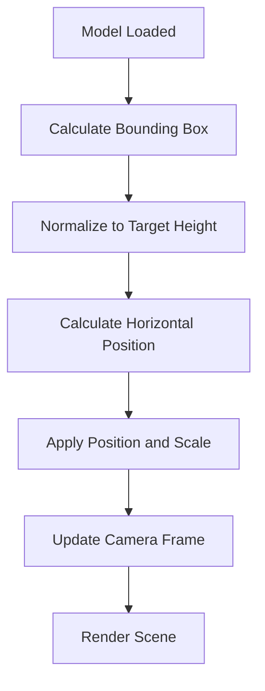
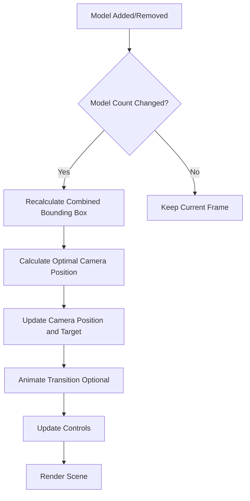

# Multi-Model VRM Viewer Architecture Design

## Overview

This document outlines the design for transforming the VRM viewer from a single-model architecture to a multi-model architecture that supports loading, displaying, and managing multiple VRM models side by side.

## Current Architecture Analysis

### Existing Components

| Component | Current State | Notes |
|-----------|---------------|-------|
| [`vrmStore.ts`](../src/store/vrmStore.ts) | Single `currentModel: VRMModel \| null` | Uses Zustand for state management |
| [`useVRM.ts`](../src/hooks/useVRM.ts) | Clears model before loading new one | `clearStoreModel()` called before each load |
| [`VRMViewer.tsx`](../src/components/viewer/VRMViewer.tsx) | Clears scene before adding new model | Lines 210-218 clear previous models |
| [`SceneManager.ts`](../src/core/three/scene/SceneManager.ts) | Already supports `Map<string, THREE.Group>` | Ready for multi-model use |
| [`CameraManager.ts`](../src/core/three/scene/CameraManager.ts) | Has focus, reset, position methods | Can be extended for multi-model framing |
| [`App.tsx`](../src/App.tsx) | Main app with single model logic | Needs updates for multi-model UI |

### VRMModel Type

```typescript
export interface VRMModel {
  vrm: VRMType;
  metadata: VRMMetadata;
  expressions: Map<string, unknown>;
  humanoid: VRMHumanoid;
  firstPerson: unknown;
  scene: THREE.Group;
  skeleton: THREE.Skeleton;
}
```

---

## 1. State Management Changes

### 1.1 New vrmStore Structure

The store will be refactored to support multiple models with individual management.

```typescript
/**
 * Extended VRM model entry with runtime properties
 */
interface VRMModelEntry {
  id: string;
  model: VRMModel;
  position: THREE.Vector3;
  isVisible: boolean;
  isWireframe: boolean;
  scale: number;
  loadedAt: number;
}

/**
 * New VRM Store State
 */
interface VRMStoreState {
  models: Map<string, VRMModelEntry>;  // Changed from single currentModel
  activeModelId: string | null;         // Currently selected model for controls
  isLoading: boolean;
  loadingModelId: string | null;        // Which model is currently loading
  error: Map<string, string>;           // Per-model error tracking
  layout: {
    spacing: number;                    // Horizontal spacing between models
    targetHeight: number;               // Target height for normalization
  };
}

/**
 * New VRM Store Actions
 */
interface VRMStoreActions {
  // Model management
  addModel: (id: string, model: VRMModel, position?: THREE.Vector3) => void;
  removeModel: (id: string) => void;
  clearAllModels: () => void;
  
  // Active model selection
  setActiveModel: (id: string | null) => void;
  getActiveModel: () => VRMModelEntry | null;
  getModel: (id: string) => VRMModelEntry | undefined;
  getAllModels: () => VRMModelEntry[];
  
  // Model properties
  setModelPosition: (id: string, position: THREE.Vector3) => void;
  setModelVisibility: (id: string, visible: boolean) => void;
  setModelWireframe: (id: string, wireframe: boolean) => void;
  setModelScale: (id: string, scale: number) => void;
  
  // Layout configuration
  setLayoutSpacing: (spacing: number) => void;
  setLayoutTargetHeight: (height: number) => void;
  
  // Loading state
  setLoading: (loading: boolean, modelId?: string) => void;
  setError: (id: string, error: string | null) => void;
  clearAllErrors: () => void;
}
```

### 1.2 Store Migration Strategy

1. **Backward Compatibility**: Keep `currentModel` as a computed getter for existing code
2. **Gradual Migration**: Update components one at a time
3. **Testing**: Ensure all existing tests pass before adding new features

```typescript
// Backward compatibility helper
const currentModel = computed(() => {
  const activeId = get().activeModelId;
  return activeId ? get().models.get(activeId)?.model : null;
});
```

---

## 2. Model Positioning Strategy

### 2.1 Layout Algorithm

Models will be positioned horizontally with configurable spacing.

```typescript
/**
 * Calculate positions for side-by-side layout
 * @param modelIds Array of model IDs
 * @param spacing Horizontal spacing between models
 * @returns Map of model ID to position
 */
function calculateModelPositions(
  modelIds: string[],
  spacing: number
): Map<string, THREE.Vector3> {
  const positions = new Map<string, THREE.Vector3>();
  const totalWidth = (modelIds.length - 1) * spacing;
  const startX = -totalWidth / 2;
  
  modelIds.forEach((id, index) => {
    const x = startX + index * spacing;
    positions.set(id, new THREE.Vector3(x, 0, 0));
  });
  
  return positions;
}
```

### 2.2 Model Normalization

Each model needs to be normalized to consistent size and position.

```typescript
/**
 * Normalize model for consistent display
 * @param model The VRM model to normalize
 * @param targetHeight Target height in meters
 * @returns Scale factor and position offset
 */
function normalizeModel(
  model: VRMModel,
  targetHeight: number
): { scale: number; yOffset: number } {
  // Calculate bounding box
  const box = new THREE.Box3().setFromObject(model.scene);
  const size = box.getSize(new THREE.Vector3());
  
  // Calculate scale to reach target height
  const scale = targetHeight / size.y;
  
  // Calculate Y offset to place model on ground
  const yOffset = -box.min.y * scale;
  
  return { scale, yOffset };
}
```

### 2.3 Positioning Constants

```typescript
// Default layout configuration
const DEFAULT_LAYOUT = {
  SPACING: 1.5,           // Meters between models
  TARGET_HEIGHT: 1.6,     // Meters (average human height)
  MAX_MODELS: 10,         // Maximum recommended models
  Z_OFFSET: 0,            // All models on same Z plane
};
```

### 2.4 Positioning Workflow



---

## 3. Camera Adjustment Strategy

### 3.1 Multi-Model Framing

The camera needs to adjust to frame all loaded models.

```typescript
/**
 * Calculate camera position to frame all models
 * @param models Array of model entries
 * @param camera The perspective camera
 * @returns Camera position and target
 */
function calculateCameraFraming(
  models: VRMModelEntry[],
  camera: THREE.PerspectiveCamera
): { position: THREE.Vector3; target: THREE.Vector3 } {
  if (models.length === 0) {
    return {
      position: new THREE.Vector3(0, 1.5, 2),
      target: new THREE.Vector3(0, 1, 0),
    };
  }
  
  // Calculate combined bounding box
  const combinedBox = new THREE.Box3();
  models.forEach(entry => {
    const box = new THREE.Box3().setFromObject(entry.model.scene);
    combinedBox.union(box);
  });
  
  const center = combinedBox.getCenter(new THREE.Vector3());
  const size = combinedBox.getSize(new THREE.Vector3());
  
  // Calculate camera distance based on field of view
  const fov = camera.fov * (Math.PI / 180);
  const aspect = camera.aspect;
  const maxDimension = Math.max(size.x, size.y);
  const distance = maxDimension / (2 * Math.tan(fov / 2)) * 1.5;
  
  // Position camera
  const position = new THREE.Vector3(
    center.x,
    center.y + size.y * 0.5,
    center.z + distance
  );
  
  return { position, target: center };
}
```

### 3.2 CameraManager Extensions

Add new methods to [`CameraManager`](../src/core/three/scene/CameraManager.ts):

```typescript
class CameraManager {
  // ... existing methods ...
  
  /**
   * Frame multiple models in view
   */
  frameModels(models: VRMModelEntry[]): void {
    const framing = calculateCameraFraming(models, this.camera);
    this.camera.position.copy(framing.position);
    this.controls.target.copy(framing.target);
    this.controls.update();
  }
  
  /**
   * Auto-adjust camera based on model count
   */
  autoAdjustCamera(modelCount: number): void {
    const baseDistance = 2;
    const extraDistancePerModel = 0.8;
    const distance = baseDistance + (modelCount - 1) * extraDistancePerModel;
    
    this.camera.position.z = distance;
    this.controls.update();
  }
  
  /**
   * Animate camera to new position
   */
  animateToPosition(
    targetPosition: THREE.Vector3,
    targetLookAt: THREE.Vector3,
    duration: number = 500
  ): void {
    // Implement smooth camera transition
  }
}
```

### 3.3 Camera Adjustment Workflow



---

## 4. UI Components Design

### 4.1 ModelList Component

A horizontal list showing all loaded models with remove buttons.

```typescript
/**
 * ModelList Component Props
 */
interface ModelListProps {
  models: VRMModelEntry[];
  activeModelId: string | null;
  onModelSelect: (id: string) => void;
  onModelRemove: (id: string) => void;
  onModelToggleVisibility: (id: string) => void;
}

/**
 * ModelList Component
 * Displays horizontal list of loaded models with controls
 */
export const ModelList: React.FC<ModelListProps> = ({
  models,
  activeModelId,
  onModelSelect,
  onModelRemove,
  onModelToggleVisibility,
}) => {
  return (
    <div className="flex items-center gap-2 p-2 bg-gray-800 rounded-lg">
      {models.map((entry) => (
        <ModelCard
          key={entry.id}
          entry={entry}
          isActive={entry.id === activeModelId}
          onSelect={() => onModelSelect(entry.id)}
          onRemove={() => onModelRemove(entry.id)}
          onToggleVisibility={() => onModelToggleVisibility(entry.id)}
        />
      ))}
    </div>
  );
};
```

### 4.2 ModelCard Component

Individual model card with name, thumbnail, and controls.

```typescript
/**
 * ModelCard Component Props
 */
interface ModelCardProps {
  entry: VRMModelEntry;
  isActive: boolean;
  onSelect: () => void;
  onRemove: () => void;
  onToggleVisibility: () => void;
}

/**
 * ModelCard Component
 * Single model entry in the list
 */
export const ModelCard: React.FC<ModelCardProps> = ({
  entry,
  isActive,
  onSelect,
  onRemove,
  onToggleVisibility,
}) => {
  return (
    <div
      className={`
        relative flex items-center gap-2 px-3 py-2 rounded-md cursor-pointer
        transition-colors
        ${isActive ? 'bg-blue-600 text-white' : 'bg-gray-700 hover:bg-gray-600'}
      `}
      onClick={onSelect}
    >
      {/* Thumbnail or placeholder */}
      <div className="w-10 h-10 bg-gray-600 rounded overflow-hidden">
        {entry.model.metadata.thumbnail ? (
          
        ) : (
          <div className="w-full h-full flex items-center justify-center text-xs">
            {entry.model.metadata.title.charAt(0)}
          </div>
        )}
      </div>
      
      {/* Model name */}
      <div className="flex-1 min-w-0">
        <p className="text-sm font-medium truncate">
          {entry.model.metadata.title}
        </p>
        <p className="text-xs opacity-70">
          {entry.isVisible ? 'Visible' : 'Hidden'}
        </p>
      </div>
      
      {/* Visibility toggle */}
      <button
        onClick={(e) => {
          e.stopPropagation();
          onToggleVisibility();
        }}
        className="p-1 hover:bg-black/20 rounded"
      >
        {entry.isVisible ? (
          <EyeIcon className="w-4 h-4" />
        ) : (
          <EyeOffIcon className="w-4 h-4" />
        )}
      </button>
      
      {/* Remove button */}
      <button
        onClick={(e) => {
          e.stopPropagation();
          onRemove();
        }}
        className="p-1 hover:bg-red-500/20 rounded text-red-400 hover:text-red-300"
      >
        <XIcon className="w-4 h-4" />
      </button>
    </div>
  );
};
```

### 4.3 ModelSelector Component

Dropdown or selector for choosing active model.

```typescript
/**
 * ModelSelector Component Props
 */
interface ModelSelectorProps {
  models: VRMModelEntry[];
  activeModelId: string | null;
  onSelect: (id: string | null) => void;
}

/**
 * ModelSelector Component
 * Dropdown to select active model for controls
 */
export const ModelSelector: React.FC<ModelSelectorProps> = ({
  models,
  activeModelId,
  onSelect,
}) => {
  return (
    <Select
      value={activeModelId || ''}
      onChange={(value) => onSelect(value || null)}
      placeholder="Select a model"
    >
      <option value="">All Models</option>
      {models.map((entry) => (
        <option key={entry.id} value={entry.id}>
          {entry.model.metadata.title}
        </option>
      ))}
    </Select>
  );
};
```

### 4.4 UI Layout

```mermaid
flowchart TB
    subgraph Viewer
        A[3D Canvas]
    end
    
    subgraph UI Overlay
        B[Top Bar]
        C[Model List - Horizontal]
        D[Model Selector - Dropdown]
        E[Bottom Controls]
    end
    
    B --> C
    B --> D
    E --> F[Animation Controls]
    E --> G[Playback Controls]
    E --> H[Model Controls]
    
    style A fill:#1a1a2e
    style C fill:#374151
    style D fill:#374151
    style E fill:#374151
```



---

## 5. Component Updates Required

### 5.1 vrmStore.ts

**Changes:**
- Replace `currentModel` with `models: Map<string, VRMModelEntry>`
- Add `activeModelId` state
- Add new actions for multi-model management
- Add backward compatibility getter for `currentModel`

**Migration Steps:**
1. Define new interfaces
2. Update store state structure
3. Implement new actions
4. Add backward compatibility layer
5. Update tests

### 5.2 useVRM.ts

**Changes:**
- Remove `clearStoreModel()` calls before loading
- Generate unique IDs for new models
- Add `addModel` function that generates ID and adds to store
- Add `removeModel` function
- Add `setActiveModel` function
- Return new functions: `addModel`, `removeModel`, `setActiveModel`, `getAllModels`

**New Functions:**
```typescript
export function useVRM() {
  // ... existing code ...
  
  const addModel = useCallback(async (file: File): Promise<string | null> => {
    setLoading(true);
    clearError();
    
    const modelId = generateUniqueId();
    
    try {
      const validation = validateModelFile(file);
      if (!validation.valid) {
        setError(modelId, validation.error || 'Invalid file');
        setLoading(false);
        return null;
      }
      
      const result = await loaderManager.loadFromFile(file);
      
      if (result.success && result.data) {
        // ... load model logic ...
        
        // Add to store with generated ID
        addModelToStore(modelId, vrmLikeModel);
        
        // Set as active if first model
        if (models.size === 1) {
          setActiveModel(modelId);
        }
        
        return modelId;
      }
    } catch (err) {
      setError(modelId, err instanceof Error ? err.message : 'Unknown error');
    } finally {
      setLoading(false);
    }
    
    return null;
  }, [/* dependencies */]);
  
  const removeModel = useCallback((id: string) => {
    removeModelFromStore(id);
    
    // If active model was removed, select another
    if (activeModelId === id) {
      const remaining = Array.from(models.keys());
      setActiveModel(remaining.length > 0 ? remaining[0] : null);
    }
  }, [activeModelId, models]);
  
  return {
    // ... existing returns ...
    addModel,
    removeModel,
    setActiveModel,
    getAllModels: () => Array.from(models.values()),
  };
}
```

### 5.3 VRMViewer.tsx

**Changes:**
- Remove scene clearing logic (lines 210-218)
- Iterate through all models and add to scene
- Apply individual positioning and scaling to each model
- Update camera when models change
- Handle visibility and wireframe per model

**New Logic:**
```typescript
useEffect(() => {
  if (!isInitialized || !sceneRef.current) return;
  
  const { models, layout } = useVRMStore.getState();
  const modelEntries = Array.from(models.values());
  
  // Calculate positions
  const positions = calculateModelPositions(
    modelEntries.map(e => e.id),
    layout.spacing
  );
  
  // Add/update each model
  modelEntries.forEach(entry => {
    const model = entry.model;
    const position = positions.get(entry.id);
    
    if (position) {
      // Normalize model
      const { scale, yOffset } = normalizeModel(model, layout.targetHeight);
      
      // Apply position and scale
      model.scene.position.copy(position);
      model.scene.position.y = yOffset;
      model.scene.scale.setScalar(scale);
      
      // Add to scene if not already added
      if (!model.scene.parent) {
        sceneRef.current!.add(model.scene);
      }
    }
  });
  
  // Update camera to frame all models
  if (cameraManager && modelEntries.length > 0) {
    cameraManager.frameModels(modelEntries);
  }
}, [models, isInitialized]);
```

### 5.4 App.tsx

**Changes:**
- Update to use new multi-model functions
- Add ModelList component to UI
- Handle model selection for controls
- Update control logic to work with active model
- Add remove model functionality

**New UI Structure:**
```tsx
<div className="relative flex flex-col h-full">
  {/* Model List (top bar) */}
  {models.length > 0 && (
    <div className="absolute top-4 left-4 right-4 z-10">
      <ModelList
        models={Array.from(models.values())}
        activeModelId={activeModelId}
        onModelSelect={setActiveModel}
        onModelRemove={removeModel}
        onModelToggleVisibility={toggleModelVisibility}
      />
    </div>
  )}
  
  {/* Viewer */}
  <div className="flex-1 relative">
    <VRMViewer ref={vrmViewerRef} />
    
    {/* Controls - now apply to active model */}
    {hasModel && (
      <div className="absolute bottom-4 left-4 right-4 space-y-3">
        <AnimationControls /* ... */ />
        <PlaybackControls /* ... */ />
        <ModelControls
          isVisible={activeModel?.isVisible ?? true}
          onVisibilityToggle={() => toggleModelVisibility(activeModelId!)}
          isWireframe={activeModel?.isWireframe ?? false}
          onWireframeToggle={() => toggleModelWireframe(activeModelId!)}
          onResetPose={handleResetPose}
          onResetCamera={handleResetCamera}
        />
      </div>
    )}
  </div>
  
  {/* Drop Zone (when no models) */}
  {models.length === 0 && (
    <DropZone onDrop={handleDrop} />
  )}
</div>
```

### 5.5 New Files

Create new component files:

```
src/components/model/
├── ModelList.tsx          # Horizontal list of models
├── ModelCard.tsx          # Individual model card
└── ModelSelector.tsx      # Dropdown selector
```

Create utility file:

```
src/utils/modelLayout.ts   # Positioning and layout utilities
```

---

## 6. Implementation Plan

### Phase 1: Store Refactoring
- [ ] Update [`vrmStore.ts`](../src/store/vrmStore.ts) with new structure
- [ ] Add backward compatibility layer
- [ ] Update [`vrmStore.test.ts`](../src/store/vrmStore.test.ts)
- [ ] Verify existing functionality still works

### Phase 2: Hook Updates
- [ ] Update [`useVRM.ts`](../src/hooks/useVRM.ts) with new functions
- [ ] Remove model clearing logic
- [ ] Add ID generation
- [ ] Test model loading

### Phase 3: Layout Utilities
- [ ] Create [`src/utils/modelLayout.ts`](../src/utils/modelLayout.ts)
- [ ] Implement `calculateModelPositions()`
- [ ] Implement `normalizeModel()`
- [ ] Add unit tests

### Phase 4: Camera Extensions
- [ ] Update [`CameraManager.ts`](../src/core/three/scene/CameraManager.ts)
- [ ] Add `frameModels()` method
- [ ] Add `autoAdjustCamera()` method
- [ ] Test camera framing

### Phase 5: UI Components
- [ ] Create `ModelList.tsx`
- [ ] Create `ModelCard.tsx`
- [ ] Create `ModelSelector.tsx`
- [ ] Add styling

### Phase 6: Viewer Updates
- [ ] Update [`VRMViewer.tsx`](../src/components/viewer/VRMViewer.tsx)
- [ ] Remove scene clearing
- [ ] Add multi-model rendering
- [ ] Integrate camera framing

### Phase 7: App Integration
- [ ] Update [`App.tsx`](../src/App.tsx)
- [ ] Integrate ModelList component
- [ ] Update control logic
- [ ] Add remove functionality

### Phase 8: Testing & Polish
- [ ] End-to-end testing
- [ ] Performance optimization
- [ ] Edge case handling
- [ ] Documentation updates

---

## 7. Edge Cases & Considerations

### 7.1 Performance

- **Model Count Limit**: Consider maximum of 10-15 models for performance
- **LOD (Level of Detail)**: Implement LOD for distant models if needed
- **Instanced Rendering**: Consider instancing for identical models

### 7.2 Error Handling

- **Load Failures**: Track errors per model, don't block other models
- **Invalid Models**: Skip invalid models but continue loading others
- **Memory Management**: Properly dispose removed models

### 7.3 User Experience

- **First Load**: Auto-select first loaded model as active
- **Last Removal**: Clear scene when all models removed
- **Camera Reset**: Option to reset camera to default view
- **Model Reordering**: Future feature to reorder models in list

### 7.4 Animation Support

- **Per-Model Animation**: Each model can have its own animation
- **Synchronized Animation**: Option to apply same animation to all models
- **Animation State**: Track animation state per model

---

## 8. Future Enhancements

### 8.1 Advanced Layouts

- Grid layout (2x2, 3x3)
- Circular layout
- Custom positioning with drag-and-drop

### 8.2 Model Comparison

- Side-by-side comparison mode
- Difference highlighting
- Synchronized posing

### 8.3 Scene Management

- Save/load model configurations
- Preset layouts
- Scene templates

### 8.4 Collaboration

- Share model configurations
- Multi-user viewing
- Annotation tools

---

## 9. Testing Strategy

### 9.1 Unit Tests

- Store actions and state changes
- Layout calculation functions
- Camera framing calculations

### 9.2 Integration Tests

- Model loading workflow
- Model removal workflow
- Camera adjustment on model changes

### 9.3 E2E Tests

- Load multiple models via drag-and-drop
- Remove models via UI
- Switch active model
- Verify camera framing

---

## 10. API Reference

### 10.1 Store Actions

| Action | Parameters | Description |
|--------|-----------|-------------|
| `addModel` | `id, model, position` | Add a new model to the store |
| `removeModel` | `id` | Remove a model from the store |
| `setActiveModel` | `id` | Set the currently active model |
| `setModelPosition` | `id, position` | Update model position |
| `setModelVisibility` | `id, visible` | Toggle model visibility |
| `setModelWireframe` | `id, wireframe` | Toggle model wireframe mode |

### 10.2 Utility Functions

| Function | Parameters | Returns | Description |
|----------|-----------|---------|-------------|
| `calculateModelPositions` | `modelIds, spacing` | `Map<string, Vector3>` | Calculate horizontal positions |
| `normalizeModel` | `model, targetHeight` | `{scale, yOffset}` | Normalize model size |
| `calculateCameraFraming` | `models, camera` | `{position, target}` | Calculate camera framing |

---

## Appendix A: Type Definitions

```typescript
/**
 * Extended VRM model entry
 */
interface VRMModelEntry {
  id: string;
  model: VRMModel;
  position: THREE.Vector3;
  isVisible: boolean;
  isWireframe: boolean;
  scale: number;
  loadedAt: number;
}

/**
 * Layout configuration
 */
interface LayoutConfig {
  spacing: number;
  targetHeight: number;
}

/**
 * Camera framing result
 */
interface CameraFraming {
  position: THREE.Vector3;
  target: THREE.Vector3;
}
```

---

## Appendix B: Constants

```typescript
/**
 * Default layout constants
 */
export const DEFAULT_LAYOUT = {
  SPACING: 1.5,
  TARGET_HEIGHT: 1.6,
  MAX_MODELS: 10,
  Z_OFFSET: 0,
} as const;

/**
 * Camera constants
 */
export const CAMERA_CONSTANTS = {
  DEFAULT_FOV: 60,
  DEFAULT_NEAR: 0.1,
  DEFAULT_FAR: 10000,
  MIN_DISTANCE: 0.5,
  MAX_DISTANCE: 50,
  DEFAULT_POSITION: new THREE.Vector3(0, 1.5, 2),
  DEFAULT_TARGET: new THREE.Vector3(0, 1, 0),
} as const;
```

---

## Appendix C: Migration Checklist

- [ ] Backup current code
- [ ] Create feature branch
- [ ] Update store structure
- [ ] Update hooks
- [ ] Create utility functions
- [ ] Update camera manager
- [ ] Create UI components
- [ ] Update viewer component
- [ ] Update app component
- [ ] Run all tests
- [ ] Manual testing
- [ ] Update documentation
- [ ] Code review
- [ ] Merge to main

---

*Document Version: 1.0*
*Last Updated: 2025-01-17*
*Author: Architect Mode*
