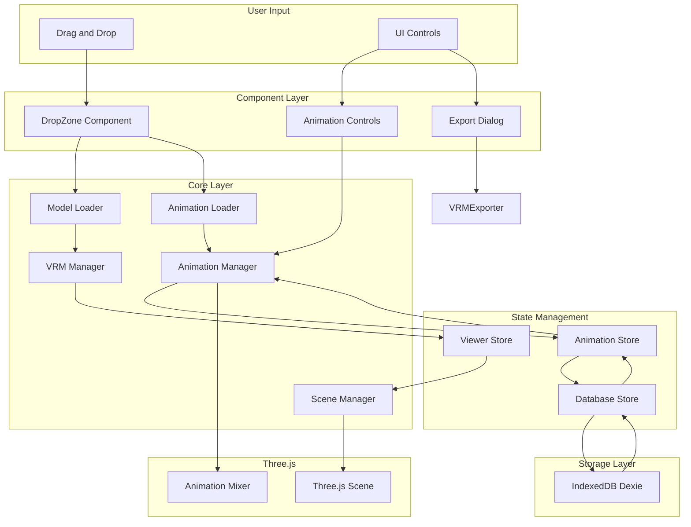
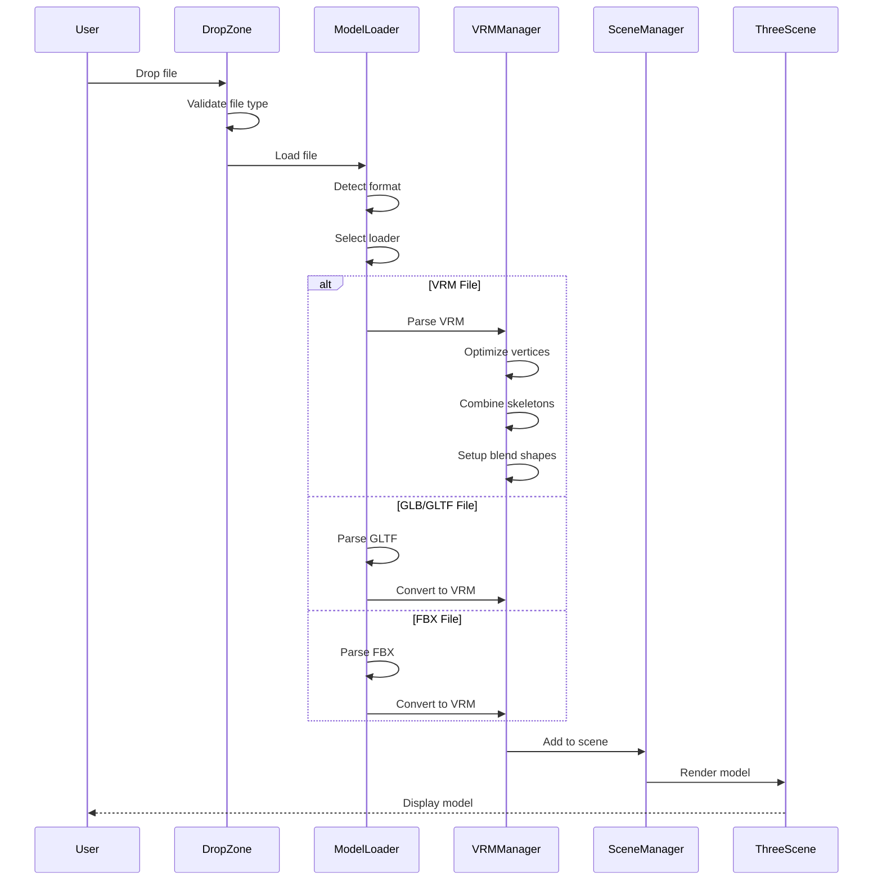
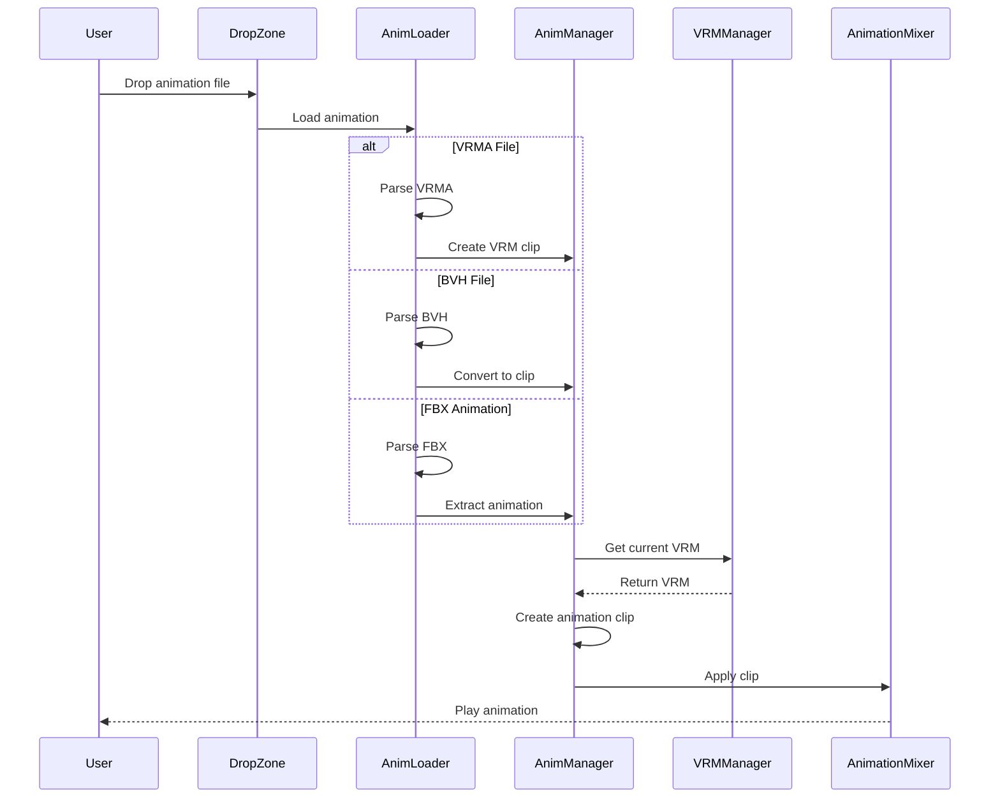
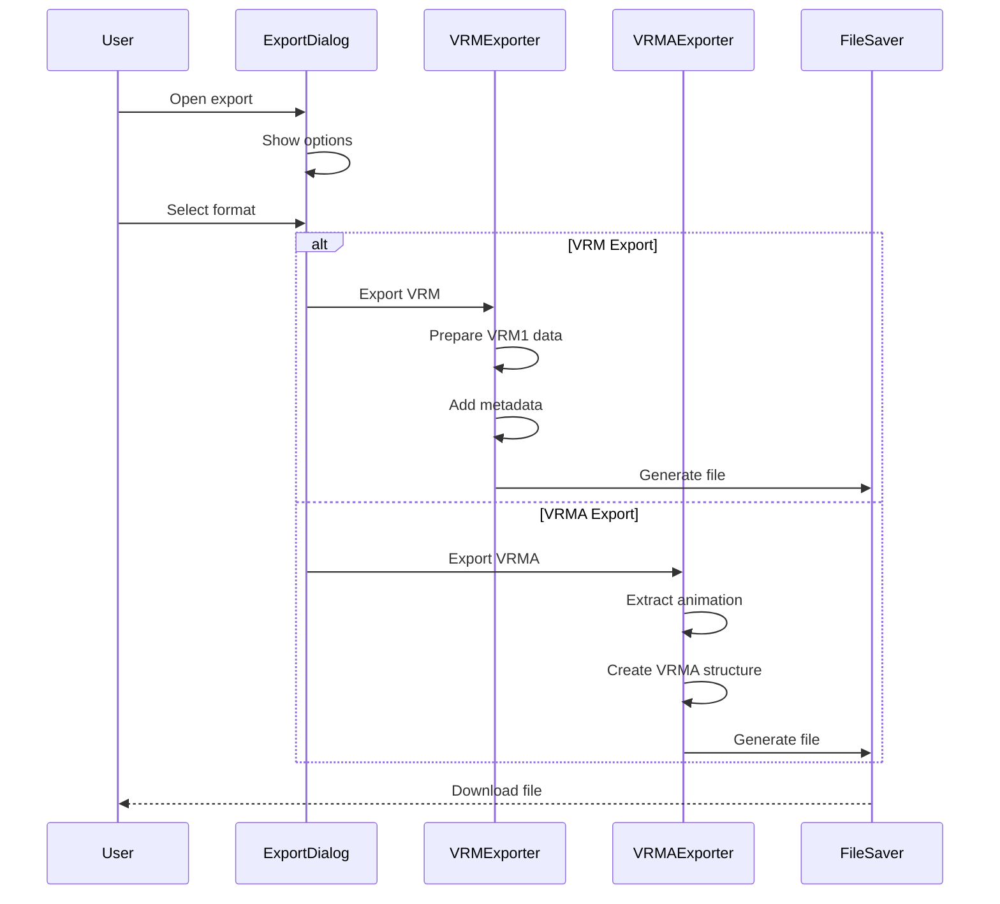
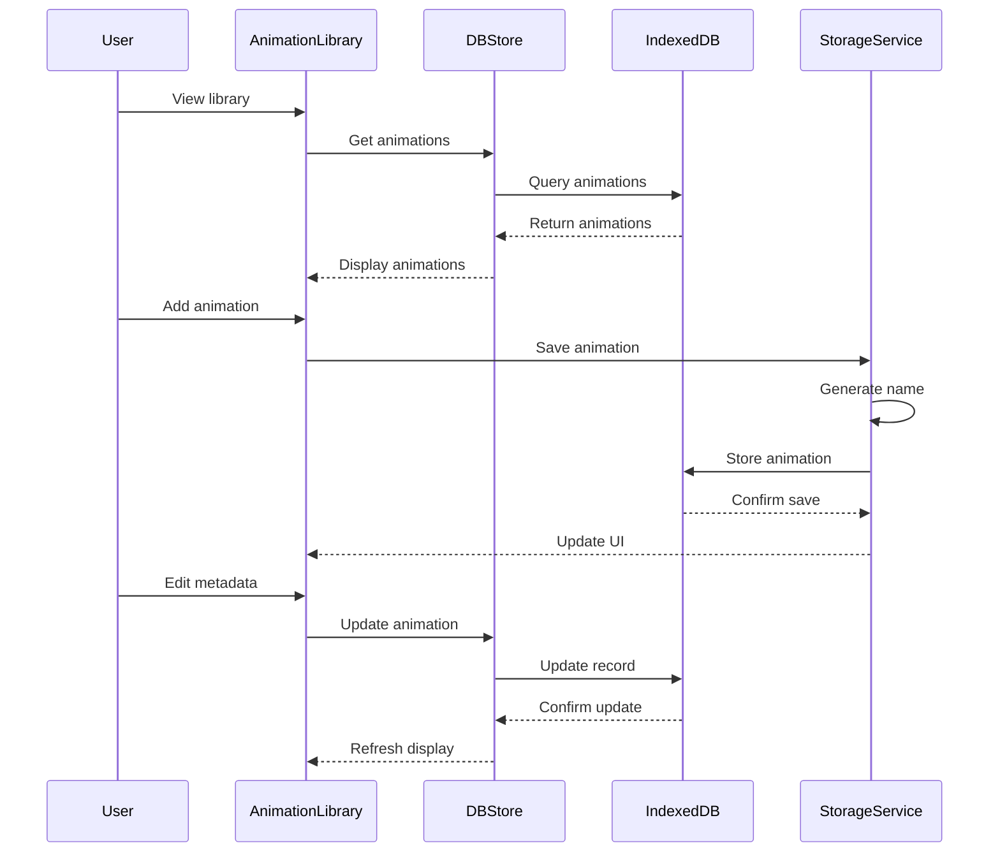
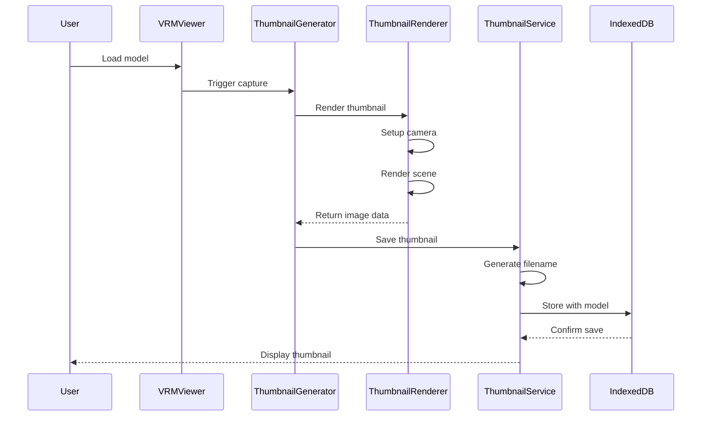
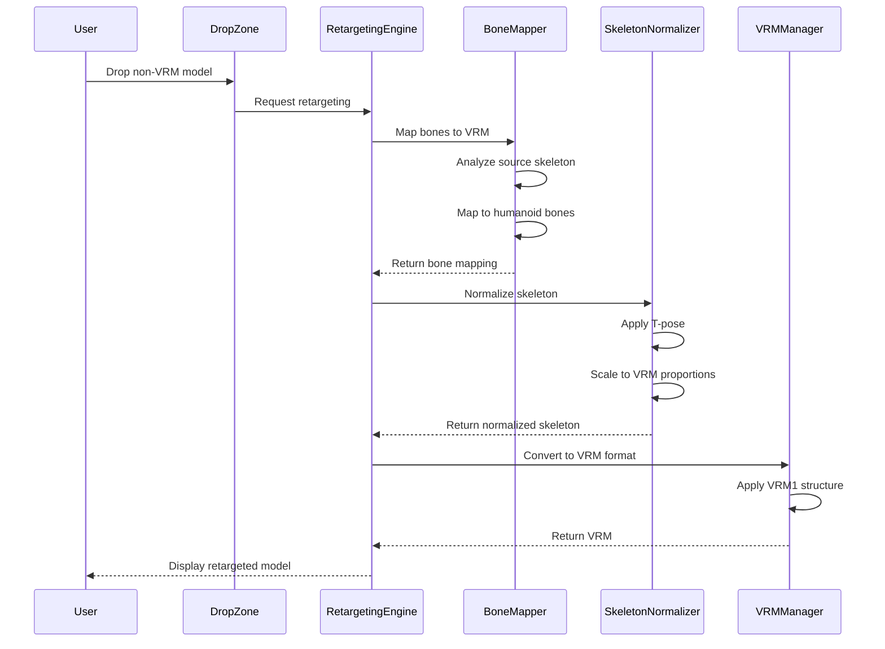

# VRM Viewer with Drag-and-Drop Animation System
## Complete Architecture Design

---

## 1. Tech Stack Selection

### 1.1 Frontend Framework
| Technology | Version | Justification |
|------------|---------|---------------|
| **React** | 18+ | - Largest ecosystem and community support<br>- Excellent component-based architecture<br>- Extensive documentation and examples<br>- Strong TypeScript support<br>- Virtual DOM for efficient rendering<br>- Wide range of UI libraries available |

### 1.2 3D Rendering Engine
| Technology | Version | Justification |
|------------|---------|---------------|
| **Three.js** | r150+ | - Industry-standard WebGL library<br>- Excellent performance and optimization<br>- Extensive loader support (GLTF, FBX, BVH)<br>- Active development and community<br>- VRM-compatible ecosystem |

### 1.3 VRM Support Libraries
| Technology | Version | Justification |
|------------|---------|---------------|
| **@pixiv/three-vrm** | 2.1+ | - Official VRM library by pixiv<br>- Full VRM 1.0 specification support<br>- Blend shape and lipsync support<br>- Built-in optimization utilities<br>- Expression management |
| **@pixiv/three-vrm-animation** | 0.1+ | - VRMA (VRM Animation) format support<br>- Animation clip creation and management<br>- Look-at animation support<br>- Seamless integration with three-vrm |

### 1.4 3D Format Loaders
| Format | Loader | Library |
|--------|--------|---------|
| GLB/GLTF | `GLTFLoader` | three/addons/loaders/GLTFLoader.js |
| VRM | `VRMLoaderPlugin` | @pixiv/three-vrm |
| FBX | `FBXLoader` | three/addons/loaders/FBXLoader.js |
| BVH | `BVHLoader` | three/addons/loaders/BVHLoader.js |
| VRMA | `VRMAnimationLoaderPlugin` | @pixiv/three-vrm-animation |

### 1.5 Animation System
| Technology | Justification |
|------------|---------------|
| **THREE.AnimationMixer** | Built-in Three.js animation system<br>- Supports multiple animation clips<br>- Time scale control<br>- Blend and transition support |
| **THREE.AnimationClip** | - Keyframe-based animation<br>- Compatible with VRMA format<br>- Supports bone, morph, and expression tracks |

### 1.6 State Management
| Technology | Version | Justification |
|------------|---------|---------------|
| **Zustand** | 4+ | - Lightweight and simple API<br>- No boilerplate required<br>- TypeScript-first design<br>- Excellent performance<br>- Easy to test and debug |
| **React Context** | Built-in | - For component-scoped state<br>- Theme and settings management<br>- Provider pattern for global state |

### 1.7 Database/Storage

| Technology | Version | Justification |
|------------|---------|---------------|
| **IndexedDB** (via **Dexie.js**) | 3+ | - Browser-native storage<br>- Large file support (hundreds of MB to GB)<br>- Asynchronous operations<br>- Indexed queries for fast lookup<br>- Offline-first capability<br>- **No external dependencies or server required** |
| **Dexie.js** | 3+ | - Promise-based API<br>- TypeScript support<br>- Simplified IndexedDB operations<br>- Transaction support<br>- **Well-maintained and widely used** |

**Why IndexedDB over SQLite or other alternatives:**

1. **No Server Required**: IndexedDB is built into the browser, eliminating the need for a backend server. This keeps the application fully client-side and simplifies deployment.

2. **Large File Support**: IndexedDB can store hundreds of MB to GB of data, essential for storing 3D models (5-50 MB) and animations. SQLite in browsers has limited support and requires external libraries.

3. **Indexed Queries**: IndexedDB provides indexed queries for fast search and filtering of animations and models, which is critical for the animation library feature.

4. **Offline-First Capability**: IndexedDB works without an internet connection, allowing users to access their saved animations and models offline.

5. **Asynchronous API**: All IndexedDB operations are non-blocking, keeping the UI responsive during large file operations.

6. **Transaction Safety**: IndexedDB supports ACID transactions, ensuring data consistency during complex operations.

7. **No Setup Required**: No database server installation, configuration, or maintenance needed. The application just works.

8. **Privacy**: All data stays on the user's device, not sent to any external server.

9. **Widely Supported**: IndexedDB is supported by all modern browsers (Chrome, Firefox, Safari, Edge) with consistent APIs.

**Dexie.js Advantages over Raw IndexedDB:**
- Cleaner, more intuitive API
- Built-in TypeScript support
- Simplified transaction handling
- Better error handling
- Active development and community
- Well-documented with many examples
### 1.8 Build Tools
| Technology | Version | Justification |
|------------|---------|---------------|
| **Vite** | 5+ | - Fast development server<br>- Hot module replacement<br>- Optimized production builds<br>- Native ESM support<br>- Plugin ecosystem |
| **TypeScript** | 5+ | - Type safety<br>- Better IDE support<br.- Catch errors at compile time<br>- Improved code maintainability |

### 1.9 UI/Styling
| Technology | Version | Justification |
|------------|---------|---------------|
| **Tailwind CSS** | 3+ | - Utility-first CSS<br>- Rapid UI development<br.- Responsive design<br.- Dark mode support<br.- Small bundle size |
| **Lucide React** | Latest | - Modern icon library<br>- Tree-shakeable<br>- Consistent design |

### 1.10 Additional Libraries
| Technology | Purpose |
|------------|---------|
| **react-dropzone** | Drag-and-drop file handling |
| **file-saver** | File download/export functionality |
| **uuid** | Unique identifier generation |
| **date-fns** | Date formatting and manipulation |
| **html2canvas** | Thumbnail capture from WebGL canvas |
| **three/examples/jsm/exporters/GLTFExporter** | GLTF export for thumbnail rendering |

---

## 2. Project Folder Structure

```
vrmviewer/
├── public/
│   ├── favicon.ico
│   └── index.html
├── src/
│   ├── assets/
│   │   ├── icons/
│   │   └── default-models/
│   ├── components/
│   │   ├── viewer/
│   │   │   ├── VRMViewer.tsx
│   │   │   ├── SceneSetup.tsx
│   │   │   ├── Lighting.tsx
│   │   │   ├── GridHelper.tsx
│   │   │   └── ThumbnailCapture.tsx
│   │   ├── controls/
│   │   │   ├── AnimationControls.tsx
│   │   │   ├── PlaybackControls.tsx
│   │   │   └── ModelControls.tsx
│   │   ├── dragdrop/
│   │   │   ├── DropZone.tsx
│   │   │   └── FilePreview.tsx
│   │   ├── export/
│   │   │   ├── ExportDialog.tsx
│   │   │   └── ExportOptions.tsx
│   │   ├── database/
│   │   │   ├── AnimationLibrary.tsx
│   │   │   ├── AnimationCard.tsx
│   │   │   ├── AnimationEditor.tsx
│   │   │   └── ModelLibrary.tsx
│   │   ├── ui/
│   │   │   ├── Button.tsx
│   │   │   ├── Dialog.tsx
│   │   │   ├── Input.tsx
│   │   │   └── Select.tsx
│   │   └── layout/
│   │       ├── Header.tsx
│   │       ├── Sidebar.tsx
│   │       └── MainLayout.tsx
│   ├── core/
│   │   ├── three/
│   │   │   ├── scene/
│   │   │   │   ├── SceneManager.ts
│   │   │   │   ├── CameraManager.ts
│   │   │   │   └── LightingManager.ts
│   │   │   ├── thumbnail/
│   │   │   │   ├── ThumbnailGenerator.ts
│   │   │   │   └── ThumbnailRenderer.ts
│   │   │   ├── loaders/
│   │   │   │   ├── ModelLoader.ts
│   │   │   │   ├── AnimationLoader.ts
│   │   │   │   └── LoaderFactory.ts
│   │   │   ├── vrm/
│   │   │   │   ├── VRMManager.ts
│   │   │   │   ├── VRMUtils.ts
│   │   │   │   └── BlendShapeManager.ts
│   │   │   ├── animation/
│   │   │   │   ├── AnimationManager.ts
│   │   │   │   ├── IdleAnimation.ts
│   │   │   │   └── AnimationClipFactory.ts
│   │   │   ├── retargeting/
│   │   │   │   ├── RetargetingEngine.ts
│   │   │   │   ├── BoneMapper.ts
│   │   │   │   ├── AnimationRetargeter.ts
│   │   │   │   └── SkeletonNormalizer.ts
│   │   │   └── export/
│   │   │       ├── VRMExporter.ts
│   │   │       └── VRMAExporter.ts
│   │   └── database/
│   │       ├── db.ts
│   │       ├── schemas/
│   │       │   └── animationSchema.ts
│   │       ├── repositories/
│   │       │   └── AnimationRepository.ts
│   │   └── services/
│   │       ├── StorageService.ts
│   │       └── ThumbnailService.ts
│   ├── hooks/
│   │   ├── useVRMViewer.ts
│   │   ├── useAnimation.ts
│   │   ├── useDatabase.ts
│   │   ├── useExport.ts
│   │   ├── useFileNaming.ts
│   │   ├── useThumbnail.ts
│   │   └── useRetargeting.ts
│   ├── store/
│   │   ├── viewerStore.ts
│   │   ├── animationStore.ts
│   │   ├── databaseStore.ts
│   │   ├── thumbnailStore.ts
│   │   └── settingsStore.ts
│   ├── types/
│   │   ├── vrm.types.ts
│   │   ├── animation.types.ts
│   │   ├── database.types.ts
│   │   ├── export.types.ts
│   │   ├── thumbnail.types.ts
│   │   └── retargeting.types.ts
│   ├── utils/
│   │   ├── fileUtils.ts
│   │   ├── namingUtils.ts
│   │   ├── validationUtils.ts
│   │   └── formatConverters.ts
│   ├── constants/
│   │   ├── formats.ts
│   │   ├── defaults.ts
│   │   └── errors.ts
│   ├── App.tsx
│   ├── main.tsx
│   └── vite-env.d.ts
├── plans/
│   └── vrm-viewer-architecture.md
├── package.json
├── tsconfig.json
├── vite.config.ts
├── tailwind.config.js
└── README.md
```

---

## 3. Component Architecture

### 3.1 Component Hierarchy

```
App
├── MainLayout
│   ├── Header
│   │   ├── Logo
│   │   ├── ThemeToggle
│   │   └── SettingsButton
│   ├── Sidebar
│   │   ├── AnimationLibrary
│   │   │   ├── AnimationCard (repeated)
│   │   │   └── AnimationEditor
│   │   ├── ModelLibrary
│   │   │   └── ModelCard (repeated)
│   │   └── ExportButton
│   └── MainContent
│       ├── VRMViewer
│       │   ├── SceneSetup
│       │   ├── Lighting
│       │   ├── GridHelper
│       │   └── ThumbnailCapture
│       ├── DropZone
│       │   └── FilePreview
│       └── AnimationControls
│           ├── PlaybackControls
│           └── ModelControls
└── ExportDialog
    └── ExportOptions
```

### 3.2 Component Responsibilities

#### 3.2.1 Viewer Components

| Component | Responsibilities |
|-----------|-----------------|
| **VRMViewer** | - Main 3D canvas container<br>- Initialize Three.js renderer<br>- Handle window resize<br>- Coordinate with SceneManager |
| **SceneSetup** | - Create Three.js scene<br>- Setup camera and controls<br>- Initialize orbit controls |
| **Lighting** | - Configure scene lighting<br>- Ambient, directional, and fill lights<br>- Shadow setup |
| **GridHelper** | - Visual reference grid<br>- Axes helper for orientation |
| **ThumbnailCapture** | - Capture model screenshots<br>- Generate thumbnails for storage<br>- Preview thumbnail display |

#### 3.2.2 Control Components

| Component | Responsibilities |
|-----------|-----------------|
| **AnimationControls** | - Animation playback UI<br>- Play/pause/stop buttons<br>- Timeline scrubber<br>- Speed control |
| **PlaybackControls** | - Basic playback buttons<br>- Loop toggle<br>- Time scale slider |
| **ModelControls** | - Model visibility toggles<br>- Wireframe mode<br>- Reset pose button |

#### 3.2.3 Drag-and-Drop Components

| Component | Responsibilities |
|-----------|-----------------|
| **DropZone** | - Drag-and-drop event handling<br>- File type validation<br>- Visual feedback on drag |
| **FilePreview** | - Show loaded file info<br>- File type indicator<br>- Thumbnail preview |

#### 3.2.4 Export Components

| Component | Responsibilities |
|-----------|-----------------|
| **ExportDialog** | - Export modal container<br>- Format selection<br>- Export progress display |
| **ExportOptions** | - Export settings form<br>- Quality options<br>- Metadata input |

#### 3.2.5 Database Components

| Component | Responsibilities |
|-----------|-----------------|
| **AnimationLibrary** | - Display stored animations<br>- Search and filter<br>- Add/remove animations |
| **AnimationCard** | - Individual animation display<br>- Play preview<br>- Edit description |
| **AnimationEditor** | - Edit animation metadata<br>- Rename animation<br>- Add description |
| **ModelLibrary** | - Display stored models<br>- Search and filter models<br>- Add/remove models<br>- Show model thumbnails |
| **ModelCard** | - Individual model display<br>- Thumbnail preview<br>- Load model button<br>- Edit metadata |

#### 3.2.6 UI Components

| Component | Responsibilities |
|-----------|-----------------|
| **Button** | - Reusable button component<br>- Variants (primary, secondary, danger)<br>- Loading states |
| **Dialog** | - Modal dialog container<br>- Backdrop handling<br>- Close on escape |
| **Input** | - Form input component<br>- Validation states<br>- Error messages |
| **Select** | - Dropdown select component<br>- Searchable options<br>- Custom rendering |

#### 3.2.7 Layout Components

| Component | Responsibilities |
|-----------|-----------------|
| **Header** | - App header bar<br>- Navigation links<br>- User controls |
| **Sidebar** | - Collapsible sidebar<br>- Animation library<br>- Quick actions |
| **MainLayout** | - Main app layout<br>- Responsive design<br>- Theme provider |

---

## 4. Data Flow

### 4.1 High-Level Data Flow Diagram



### 4.2 Model Loading Flow



### 4.3 Animation Loading Flow



### 4.4 Export Flow



### 4.5 Database Flow



### 4.6 Thumbnail Capture Flow



### 4.7 Retargeting Flow



---

## 5. Key Integration Points

### 5.1 Model Loading and Rendering

**Integration:** [`ModelLoader`](src/core/three/loaders/ModelLoader.ts) ↔ [`VRMManager`](src/core/three/vrm/VRMManager.ts) ↔ [`SceneManager`](src/core/three/scene/SceneManager.ts)

**Key Considerations:**
- File type detection and loader selection
- VRM optimization (vertices, skeletons, morphs)
- Scene graph management
- Memory cleanup on model change
- Coordinate system conversion (VRM0.0 rotation)

### 5.2 Animation System and Blend Shapes

**Integration:** [`AnimationManager`](src/core/three/animation/AnimationManager.ts) ↔ [`VRMManager`](src/core/three/vrm/VRMManager.ts) ↔ [`BlendShapeManager`](src/core/three/vrm/BlendShapeManager.ts)

**Key Considerations:**
- Animation clip creation from VRMA/BVH/FBX
- Blend shape synchronization with animation
- Expression management (blink, lipsync)
- Look-at quaternion proxy setup
- Idle animation (breathing, blinking) layering

### 5.3 Export Functionality

**Integration:** [`VRMExporter`](src/core/three/export/VRMExporter.ts) ↔ [`VRMAExporter`](src/core/three/export/VRMAExporter.ts) ↔ [`VRMManager`](src/core/three/vrm/VRMManager.ts)

**Key Considerations:**
- VRM1 specification compliance
- Animation data extraction from mixer
- Metadata preservation
- File naming convention application
- Export progress tracking

### 5.4 Database Operations

**Integration:** [`AnimationRepository`](src/core/database/repositories/AnimationRepository.ts) ↔ [`StorageService`](src/core/database/services/StorageService.ts) ↔ [`IndexedDB`](src/core/database/db.ts)

**Key Considerations:**
- Large file storage (animations can be MBs)
- Indexed queries for search/filter
- Transaction safety
- Schema versioning
- Offline capability

### 5.5 File Naming System

**Integration:** [`useFileNaming`](src/hooks/useFileNaming.ts) ↔ [`namingUtils`](src/utils/namingUtils.ts) ↔ [`StorageService`](src/core/database/services/StorageService.ts)

**Key Considerations:**
- Descriptive name + numerical identifier pattern
- Collision detection and auto-increment
- User-friendly naming suggestions
- Validation of naming conventions
- Renaming with metadata preservation

---

## 6. Technical Considerations

### 6.1 Browser Compatibility

| Browser | Minimum Version | Notes |
|---------|----------------|-------|
| Chrome | 90+ | WebGL 2.0, IndexedDB |
| Firefox | 88+ | WebGL 2.0, IndexedDB |
| Safari | 15+ | WebGL 2.0, IndexedDB |
| Edge | 90+ | WebGL 2.0, IndexedDB |

**Key Requirements:**
- WebGL 2.0 support
- ES2020+ JavaScript features
- IndexedDB support
- File API support
- Drag and Drop API

### 6.2 Performance Optimization

**Rendering Optimizations:**
- Frustum culling disabled for VRM models (per three-vrm recommendation)
- Vertex removal via `VRMUtils.removeUnnecessaryVertices()`
- Skeleton combination via `VRMUtils.combineSkeletons()`
- Morph combination via `VRMUtils.combineMorphs()`
- Instanced rendering for repeated objects
- LOD (Level of Detail) for complex models

**Animation Optimizations:**
- Animation mixer time scale control
- Clip caching for frequently used animations
- Idle animation as lightweight layer
- Expression updates only when needed

**Memory Management:**
- Deep dispose on model change: `VRMUtils.deepDispose()`
- Blob URL cleanup after loading
- IndexedDB cleanup for deleted animations
- Texture compression where possible

**Loading Optimizations:**
- Progressive loading for large models
- Loading states and progress indicators
- Worker-based file parsing (for BVH/FBX)
- Lazy loading of animation library thumbnails

### 6.3 File Size Considerations

| Format | Typical Size | Notes |
|--------|--------------|-------|
| VRM | 5-50 MB | Compressed textures |
| GLB | 5-100 MB | Binary format |
| FBX | 10-200 MB | Can be large |
| BVH | 10-500 KB | Text-based |
| VRMA | 50-500 KB | Animation only |

**Strategies:**
- Texture compression (DRACO, KTX2)
- Mesh simplification for preview
- Animation compression
- Lazy loading of animation library
- IndexedDB storage limits (typically 50% of disk space)

### 6.4 VRM1/VRMA Specification Compliance

**VRM1 Requirements:**
- Humanoid bone hierarchy
- Meta extension (title, version, author)
- Blend shape groups
- Expression definitions
- Look-at specification
- Spring bone physics

**VRMA Requirements:**
- Humanoid animation tracks
- Expression animation tracks
- Look-at animation tracks
- Time-based keyframes
- Compatible with VRM1 models

**Implementation Notes:**
- Use official @pixiv/three-vrm library
- Follow VRM1 specification from vrm.dev
- Test with VRoid Hub models
- Validate export output with official tools

### 6.5 Idle Animation System

**Breathing Animation:**
- Subtle chest bone rotation
- Sinusoidal motion with configurable amplitude
- Independent of loaded animations
- Can be toggled on/off

**Blinking Animation:**
- Random interval between blinks
- Blend shape-based (blink expression)
- Configurable blink duration
- Can be overridden by animation

**Implementation:**
- Layered animation approach
- Idle animation at lowest priority
- Loaded animations override idle
- Smooth transitions between states

### 6.6 Drag-and-Drop System

**Supported Operations:**
- Drop model files (.vrm, .glb, .gltf, .fbx)
- Drop animation files (.vrma, .bvh, .fbx with animation)
- Drop multiple files (batch processing)

**Validation:**
- File extension checking
- MIME type validation
- File size limits
- Format compatibility check

**Feedback:**
- Visual drag-over indication
- Loading progress display
- Error messages for invalid files
- Success confirmation

### 6.7 Security Considerations

**File Handling:**
- Sanitize file names
- Validate file contents
- Limit file sizes
- Prevent path traversal

**Storage:**
- Encrypt sensitive metadata (optional)
- Validate IndexedDB operations
- Handle quota exceeded gracefully

**Export:**
- Sanitize export filenames
- Remove sensitive metadata if requested
- Validate export data before generation

### 6.8 Accessibility

**UI Accessibility:**
- Keyboard navigation support
- Screen reader compatibility
- High contrast mode
- Focus indicators
- ARIA labels

**3D Accessibility:**
- Audio description support (future)
- Alternative text for models
- Keyboard camera controls
- Reduced motion option

### 6.9 Internationalization (i18n)

**Considerations:**
- Extract all UI text
- Support RTL languages
- Date/time localization
- Number formatting
- File naming conventions per locale

### 6.10 Error Handling

**Error Categories:**
- File loading errors
- Format parsing errors
- Animation application errors
- Export errors
- Database errors

**Error Handling Strategy:**
- User-friendly error messages
- Error logging for debugging
- Graceful degradation
- Retry mechanisms where appropriate
- Error recovery suggestions

### 6.11 Thumbnail Capture System

**Capture Process:**
- Render model to offscreen canvas
- Use preset camera angles (front, side, back, isometric)
- Consistent lighting for all thumbnails
- Transparent or solid background options
- Multiple thumbnail sizes for different UI contexts

**Storage Strategy:**
- Store as base64 in IndexedDB (small thumbnails)
- Or store as Blob with reference
- Associate with model/animation metadata
- Cache frequently used thumbnails
- Lazy loading for large libraries

**Performance:**
- Capture on model load (async)
- Batch capture for multiple models
- Web Worker for image processing
- Progressive display (placeholder first)

**Quality Settings:**
- Configurable resolution
- Compression options
- Preview vs full-size thumbnails

### 6.12 Retargeting System

**Bone Mapping Strategy:**
- Map source skeleton to VRM humanoid bones
- Support common naming conventions (Mixamo, Blender, etc.)
- Heuristic-based bone matching
- Manual override capability
- Save mapping profiles for reuse

**Skeleton Normalization:**
- Convert any pose to T-pose
- Scale bones to VRM proportions
- Preserve relative proportions where possible
- Handle different skeleton hierarchies
- Support armatures with extra bones

**Animation Retargeting:**
- Convert animation tracks to VRM bone names
- Preserve timing and keyframe data
- Handle different bone rotations (Euler vs Quaternion)
- Scale animation values to match VRM
- Blend shape retargeting (if applicable)

**Clothing Asset Compatibility (Future):**
- All models use consistent VRM bone structure
- Clothing assets target standard bone names
- Scale-independent attachment points
- Compatible with any retargeted model
- Preserve mesh binding information

**Performance:**
- Retargeting on load (async)
- Cache retargeted results
- Progress indication for large models
- Worker-based processing for complex skeletons

---

## 7. Development Workflow

### 7.1 Development Setup

```bash
# Install dependencies
npm install

# Start development server
npm run dev

# Type checking
npm run type-check

# Linting
npm run lint

# Build for production
npm run build

# Preview production build
npm run preview
```

### 7.2 Testing Strategy

**Unit Tests:**
- Utility functions
- File naming logic
- Format conversion
- Database operations

**Integration Tests:**
- Model loading pipeline
- Animation application
- Export functionality
- Database CRUD operations

**E2E Tests:**
- Drag and drop workflow
- Animation playback
- Export dialog flow
- Database management

### 7.3 Code Organization Principles

**Separation of Concerns:**
- UI components separate from business logic
- Core logic in `core/` directory
- Reusable utilities in `utils/`
- Type definitions in `types/`

**Single Responsibility:**
- Each component has one clear purpose
- Each service handles one domain
- Functions are focused and testable

**Dependency Direction:**
- UI depends on hooks
- Hooks depend on stores
- Stores depend on core services
- Core services depend on libraries

---

## 8. Future Enhancements

### 8.1 Potential Features

1. **Multi-model Support**
   - Load multiple models simultaneously
   - Scene composition tools
   - Model positioning and scaling

2. **Animation Blending**
   - Blend between multiple animations
   - Transition controls
   - Custom blend curves

3. **Motion Capture Integration**
   - Webcam-based mocap
   - VR controller support
   - Real-time animation

4. **Cloud Storage**
   - Sync animations across devices
   - Share animation libraries
   - Collaborative features

5. **Advanced Export**
   - Custom VRM metadata
   - Texture baking
   - Model optimization options

6. **Animation Editor**
   - Timeline editing
   - Keyframe manipulation
   - Animation layering

### 8.2 Performance Roadmap

1. **WebGPU Support**
   - Migrate from WebGL to WebGPU
   - Compute shader support
   - Better performance on modern hardware

2. **Web Workers**
   - Offload file parsing
   - Background processing
   - Non-blocking UI

3. **Service Worker**
   - Offline PWA support
   - Cache management
   - Background sync

---

## 9. Summary

This architecture provides a comprehensive blueprint for building a VRM Viewer with drag-and-drop animation system. The recommended tech stack leverages well-established, production-ready libraries with strong community support.

**Key Highlights:**

1. **React + Three.js + @pixiv/three-vrm** provides a solid foundation for 3D web applications with VRM support
2. **Zustand** offers lightweight state management without boilerplate
3. **IndexedDB via Dexie.js** enables large file storage for animations
4. **Vite** ensures fast development and optimized production builds
5. **TypeScript** provides type safety throughout the codebase

The modular component architecture and clear separation of concerns make the codebase maintainable and extensible. The documented data flows and integration points provide a clear path for implementation.

This architecture is designed to be:
- **Performant**: Optimized rendering and loading strategies
- **Maintainable**: Clear code organization and separation of concerns
- **Extensible**: Easy to add new features and formats
- **User-friendly**: Clean UI with drag-and-drop functionality
- **Standards-compliant**: VRM1/VRMA specification adherence
